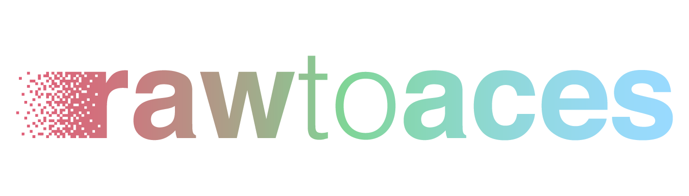

<p align="center">
  
</p>

[](https://github.com/AcademySoftwareFoundation/rawtoaces/actions/workflows/ci.yml)
[](https://github.com/AcademySoftwareFoundation/rawtoaces/actions/workflows/github-code-scanning/codeql)
[](https://www.bestpractices.dev/projects/11185)
[](https://codecov.io/gh/AcademySoftwareFoundation/rawtoaces)
[](https://rawtoaces.readthedocs.io/en/latest/)

## Introduction

The RAW to ACES Utility, `rawtoaces`, converts digital camera RAW files to
ACES AP0 image data in ACES container files. It provides a command line tool,
C++ libraries, and Python bindings.

Conversion can use measured camera spectral sensitivities and illuminant data,
matrices in the RAW file's metadata, or the Adobe camera coefficients supplied
by LibRaw through OpenImageIO. The output follows the Academy Color Encoding
Specification ([SMPTE ST 2065-1](https://pub.smpte.org/pub/st2065-1/st2065-1-2021.pdf))
and ACES Image Container specification
([SMPTE ST 2065-4](https://pub.smpte.org/pub/st2065-4/st2065-4-2023.pdf)).

## Quick start

Install the [native dependencies](src/docs/getting_started.rst#dependencies)
and make them discoverable by CMake. The following builds the CLI and C++
libraries without Python bindings or tests, and installs into a local directory.
These build, install, and conversion steps have been checked on macOS with
Homebrew dependencies; platform package setup is covered in the
[installation guide](src/docs/getting_started.rst).

```sh
git clone https://github.com/AcademySoftwareFoundation/rawtoaces.git
cd rawtoaces
cmake -S . -B build -DCMAKE_BUILD_TYPE=Release \
  -DCMAKE_INSTALL_PREFIX="$PWD/install" \
  -DRTA_BUILD_PYTHON_BINDINGS=OFF -DRTA_BUILD_TESTS=OFF
cmake --build build --config Release
cmake --install build --config Release
./install/bin/rawtoaces --version
```

Replace `input.dng` with your RAW file. The explicit data path below also works
when installing outside the default system prefix:

```sh
./install/bin/rawtoaces --data-dir "$PWD/install/share/rawtoaces/data" \
  --output-dir "$PWD/output" --create-dirs --crop-mode soft input.dng
```

The default CLI conversion uses metadata white balance and selects the spectral
matrix method when camera data is available, otherwise the metadata matrix
method. `--crop-mode soft` preserves the sensor area and records the crop in the
EXR display window. Use `--crop-mode off` for the full sensor area without that
crop, or `--crop-mode hard` to write only the crop area. The C++ and Python
settings default to hard cropping, so set the mode explicitly when comparing
interfaces.

## Documentation and source

- [Full documentation](https://rawtoaces.readthedocs.io/en/latest/)
- [Installation, data setup, and v1 CLI migration](src/docs/getting_started.rst)
- [CLI usage guide](src/docs/user_guide.rst)
- [C++ API guide](src/docs/api/cpp/index.rst) and [Python API guide](src/docs/api/python/index.rst)
- [Spectral datasets and schema](https://github.com/AcademySoftwareFoundation/rawtoaces-data)
- [Public headers](include/rawtoaces), [source](src), and [tests](tests)
- [Changes](docs/CHANGES.md) and [known issues](https://github.com/AcademySoftwareFoundation/rawtoaces/issues)

## Community

rawtoaces is a project of the [Academy Software Foundation](https://www.aswf.io/).

- [Contributing](CONTRIBUTING.md)
- [AI policy](docs/AI_Policy.md)
- [Security policy](SECURITY.md)
- [Code of conduct](CODE_OF_CONDUCT.md)
- [License](LICENSE)
- [rawtoaces-discussion mailing list](https://lists.aswf.io/g/rawtoaces-discussion)
- `#rawtoaces` channel on [ASWF Slack](https://slack.aswf.io/)
